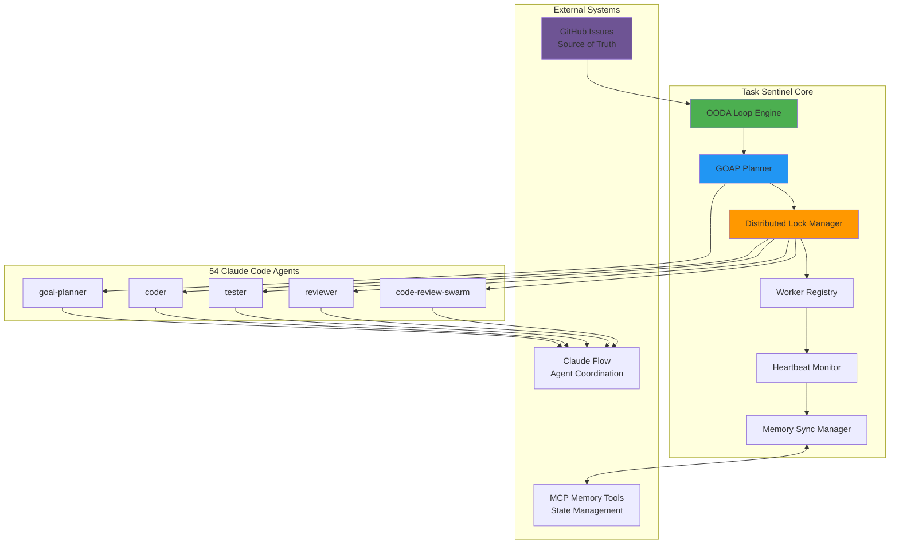
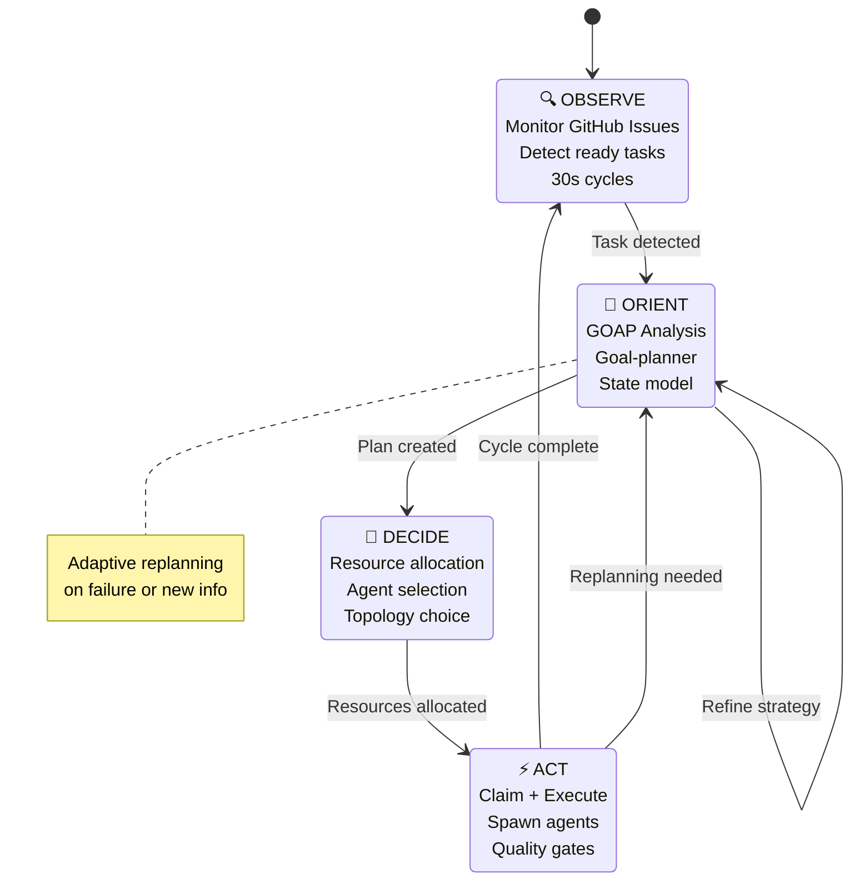
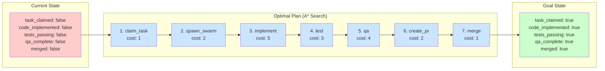
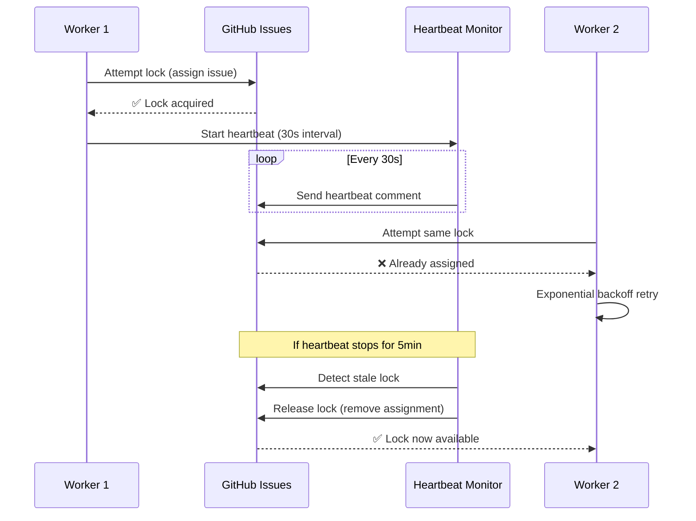

# Task Sentinel
**GitHub-Based Distributed Task Orchestration with OODA+GOAP Integration**

[](https://claude.ai)
[](https://github.com/ruvnet/claude-flow)
[](LICENSE)

## Overview

Task Sentinel is a production-ready distributed task orchestration system that leverages **GitHub Issues as source of truth** with intelligent **OODA Loop** (Observe, Orient, Decide, Act) and **GOAP** (Goal-Oriented Action Planning) integration. Built on Claude Code and Claude Flow infrastructure, it enables multiple workers to execute tasks in parallel with comprehensive quality assurance via Agentic QE.

### Key Features

- 🎯 **OODA Loop Integration** - Continuous observation, orientation, decision-making, and action
- 🧠 **GOAP Planning** - Intelligent task planning with A* search algorithms
- 🔄 **Distributed Execution** - Parallel task processing with atomic distributed locking
- 🤖 **54 Specialized Agents** - Leverage existing Claude Code agents (no custom agents needed)
- ✅ **Comprehensive QA** - Automated quality assurance with code-review-swarm + Agentic QE
- 📊 **GitHub Issues** - Transparent source of truth for all tasks and progress
- 🪝 **Automated Hooks** - Pre/post task automation with session management
- 🚀 **CI/CD Integration** - GitHub Actions workflows for automated execution
- 💾 **Persistent Memory** - Cross-session state management with MCP tools
- 🔍 **Full Observability** - Real-time monitoring and metrics tracking

## Architecture

### System Overview



## Quick Start

### Prerequisites

- [Claude Code](https://claude.ai) with CLI access
- [Claude Flow](https://github.com/ruvnet/claude-flow) v2.7.26+
- [GitHub CLI](https://cli.github.com/) authenticated
- Node.js 18+
- Git

### Installation

```bash
# Clone the repository
git clone https://github.com/yourusername/Task-Sentinel.git
cd Task-Sentinel

# Initialize Claude Flow
npx claude-flow@alpha init --force

# Authenticate GitHub CLI
gh auth login

# Configure MCP servers (if not already configured)
claude mcp add claude-flow npx claude-flow@alpha mcp start
claude mcp add ruv-swarm npx ruv-swarm mcp start  # Optional
```

### Usage

```bash
# Create a new task
/task-create --title "Implement user authentication" --priority 5000

# Claim and execute a task
/task-claim --issue 42

# Check task status
/task-status

# Run quality assurance
/task-qa --issue 42

# Complete task with evidence
/task-complete --issue 42 --pr 123
```

## OODA Loop Integration

Task Sentinel implements a continuous **OODA Loop** for adaptive task execution:



**Cycle Phases:**

1. **OBSERVE** (30s cycles) - Monitor GitHub Issues for ready tasks
2. **ORIENT** (GOAP Analysis) - Plan optimal action sequences with goal-planner
3. **DECIDE** (Resource Allocation) - Select agents, topology, and strategy
4. **ACT** (Execution) - Claim task, spawn agents, execute with quality gates
5. **Replan** (Adaptive) - On failure or new information, return to ORIENT

## GOAP Planning

Goal-Oriented Action Planning with A* search for optimal task execution:



**Planning Features:**
- **A* Search Algorithm** - Finds lowest-cost path to goal
- **State Preconditions** - Validates action requirements
- **Cost Estimation** - Heuristic-based cost calculation
- **Dynamic Replanning** - Adapts to failures and new constraints

## Agent Coordination

Task Sentinel leverages **54 existing Claude Code agents** organized by pattern:

### Coordination Patterns

| Pattern | Topology | Agents | Use Case |
|---------|----------|--------|----------|
| **Single-Goal** | Star | 3-4 | Simple features |
| **Complex** | Hierarchical | 6-10 | Large features requiring decomposition |
| **Parallel** | Mesh | Multiple swarms | Multiple independent tasks |
| **Iterative** | Adaptive | 3-5 | QA refinement loop |

### Key Agents Used

- `goal-planner`, `code-goal-planner` - GOAP planning
- `coder`, `tester`, `reviewer` - Core development
- `code-review-swarm` - Comprehensive QA
- `issue-tracker`, `pr-manager` - GitHub integration
- `queen-coordinator`, `adaptive-coordinator` - Swarm coordination
- `sparc-coder` - SPARC methodology implementation

## Documentation

### Core Documentation

- 📚 [Implementation Plan](docs/task_sentinel_implementation_plan.md) - **Comprehensive 6-week implementation plan with OODA+GOAP integration**
- 📖 [Original Plan](docs/task_sentinel_plan.md) - Original Task Sentinel design document
- 🚀 [Setup Instructions](docs/setup_instructions.md) - Complete setup guide
- 🔒 [Distributed Locking Guide](docs/distributed-locking.md) - **Complete guide to distributed locking system**
- 🏗️ [Lock Design ADR](docs/architecture/distributed-lock-design.md) - Architecture decision record for distributed locks

### Phase 3 Distributed Execution Documentation

- 📘 [Phase 3 Overview Guide](docs/phase3_guide.md) - **Complete distributed execution guide**
- 🔧 [Distributed API Reference](docs/api/distributed.md) - **Comprehensive API documentation**
- 📐 [Architecture Diagrams](docs/diagrams/architecture.md) - **Visual system architecture**
- 🚀 [Deployment Guides](docs/deployment/) - **Step-by-step deployment instructions**
  - [Single Worker Deployment](docs/deployment/single-worker.md)
  - [Multiple Worker Deployment](docs/deployment/multi-worker.md)
  - [GitHub Actions Deployment](docs/deployment/github-actions.md)
  - [Docker Deployment](docs/deployment/docker.md)

### Key Sections in Implementation Plan

1. **Architecture Overview** - System design and component responsibilities
2. **OODA Loop Integration** - Detailed Observe-Orient-Decide-Act implementation
3. **GOAP Integration Strategy** - Goal-oriented planning with state models
4. **Component Mapping** - Decision matrix for which tools to use
5. **Implementation Phases** - 6-week phased rollout plan
6. **Agent Coordination Patterns** - 5 patterns for different scenarios
7. **Workflow Examples** - 3 complete end-to-end examples
8. **Testing Strategy** - Unit, integration, and performance testing

### Configuration Files

- `.claude/skills/task-sentinel/SKILL.md` - Main Task Sentinel skill (to be created)
- `.claude/commands/task/*.md` - Slash commands for task operations (to be created)
- `.claude/settings.json` - Hooks configuration (to be configured)
- `CLAUDE.md` - Claude Code configuration and guidelines

## Features

### Distributed Locking

Task Sentinel implements a robust distributed locking system using GitHub Issues as the coordination mechanism:



**Features:**
- **Atomic Operations** - GitHub issue assignment as distributed lock primitive
- **Heartbeat Monitoring** - Automated keepalive every 30 seconds
- **Stale Lock Detection** - Automatic removal after 5 minutes of inactivity
- **Conflict Resolution** - Multiple strategies: RETRY (exponential backoff), FAIL_FAST, STEAL_STALE
- **Lock Metadata** - Worker ID, node ID, timestamps, and task info tracked in GitHub comments
- **Retry Logic** - Exponential backoff: 1s, 2s, 4s, 8s, 16s (max 5 retries)
- **Metrics Tracking** - Comprehensive monitoring of acquisitions, conflicts, and performance
- **Signal Handlers** - Graceful shutdown on SIGTERM, SIGINT, SIGHUP

📚 **Documentation**: See [Distributed Locking Guide](docs/distributed-locking.md) for detailed usage

### Quality Assurance

- **Automated QA** - code-review-swarm with multi-agent review
- **Test Generation** - Automated test creation with 85%+ coverage target
- **Security Scanning** - Vulnerability detection and remediation
- **Performance Testing** - Benchmarking and optimization
- **Evidence Collection** - All artifacts linked in GitHub Issues

### Memory & State Management

- **Persistent Memory** - Cross-session state via MCP memory tools
- **Namespace Organization** - Structured memory with TTLs
- **Context Restoration** - Resume tasks from previous sessions
- **Swarm Coordination** - Shared memory for agent communication

## Implementation Status

### Phase 1: Foundation (Week 1) - ✅ **COMPLETED**
- [x] Create Task Sentinel skill framework
- [x] Build slash commands (task-claim, task-create, etc.)
- [x] Configure hooks system
- [x] GitHub Issues integration

### Phase 2: OODA + GOAP (Week 2) - ✅ **COMPLETED**
- [x] GOAP state model implementation
- [x] OODA loop engine (Observe-Orient-Decide-Act)
- [x] Adaptive replanning with failure recovery
- [x] Goal-planner and code-goal-planner integration

### Phase 3: Distributed Execution (Week 3) - ✅ **COMPLETED**
- [x] Distributed locking system with GitHub Issues
- [x] Lock acquisition with exponential backoff retry (1s-16s)
- [x] Heartbeat monitoring for stale lock detection (5min threshold)
- [x] Conflict resolution strategies (RETRY, FAIL_FAST, STEAL_STALE)
- [x] Worker coordination and registry
- [x] Memory synchronization with vector clocks
- [x] Load balancing with multiple strategies
- [x] Comprehensive metrics and monitoring
- [x] Complete Phase 3 documentation suite
- [x] API reference for all distributed components
- [x] Architecture diagrams and visualizations
- [x] Deployment guides (single, multi, GitHub Actions, Docker)
- [x] **Security hardening** - Fixed 9 command injection vulnerabilities
- [x] **MCP integration** - Full memory coordination implementation
- [x] **Memory leak fixes** - Bounded arrays with FIFO eviction
- [x] **Race condition resolution** - Optimistic locking with CAS pattern
- [x] **Signal handlers** - Graceful shutdown for all components
- [x] **Error handling** - Heartbeat retry logic with status updates

### Phase 4: Quality Assurance (Week 4) - 🟡 In Progress
- [x] Code review system (9 PRs with comprehensive reviews)
- [x] Security scanning and vulnerability fixes
- [x] Test framework setup
- [ ] Agentic QE integration (planned)
- [ ] Automated E2E testing (planned)
- [ ] Evidence collection automation (planned)

### Phase 5: CI/CD (Week 5) - 🟡 Planned
- [ ] GitHub Actions workflows
- [ ] Event-driven automation
- [ ] Quality gates

### Phase 6: Monitoring (Week 6) - 🟡 Planned
- [ ] Monitoring dashboard
- [ ] Performance optimization
- [ ] Neural training integration

### Recent Improvements (11 Critical Fixes - All PRs Merged)

**Security & Reliability (9.2/10 Code Review Scores):**
- PR #21: Removed 7,856 tracked files (node_modules, coverage)
- PR #22: Fixed 9 command injection vulnerabilities + input sanitization
- PR #23: Implemented MCP memory integration (4 stubbed methods)
- PR #24: Fixed 5 async/await issues in metrics collection
- PR #25: Memory leak fix - bounded decisions array
- PR #26: Race condition fix - optimistic locking (CAS pattern)
- PR #27: Memory leak fix - heartbeat acquisitionTimes array
- PR #28: Signal handlers for graceful shutdown (4 components)
- PR #29: Heartbeat error handling with retry logic

## Performance Metrics

| Metric | Target | Current |
|--------|--------|---------|
| **Task Throughput** | > 50 tasks/day | TBD |
| **OODA Cycle Time** | < 5 minutes | TBD |
| **GOAP Planning Time** | < 30 seconds | TBD |
| **Test Coverage** | > 85% | TBD |
| **QA Pass Rate** | > 95% | TBD |
| **System Uptime** | > 99% | TBD |
| **Parallel Efficiency** | > 90% | TBD |

## Contributing

Contributions are welcome! Please see our contribution guidelines (to be created).

### Development Setup

```bash
# Fork the repository
# Clone your fork
git clone https://github.com/yourusername/Task-Sentinel.git

# Create a feature branch
git checkout -b feature/your-feature

# Make changes and test
# Commit with descriptive messages
git commit -m "feat: Add OODA loop monitoring dashboard"

# Push and create PR
git push origin feature/your-feature
```

## License

MIT License - see LICENSE file for details

## Acknowledgments

- **Claude Code** - AI-powered development environment
- **Claude Flow** - Multi-agent orchestration framework
- **Agentic QE** - Comprehensive quality engineering framework
- **GitHub** - Platform for distributed coordination

## Support

- 📖 [Documentation](docs/)
- 🐛 [Issue Tracker](https://github.com/yourusername/Task-Sentinel/issues)
- 💬 [Discussions](https://github.com/yourusername/Task-Sentinel/discussions)

---

**Ready to transform your task orchestration with intelligent OODA+GOAP coordination!** 🚀
