# Distributed Lock Flow Diagrams

## Complete Lock Lifecycle


## Lock Acquisition Sequence


## Heartbeat Mechanism


## Conflict Resolution Strategies


## Multi-Worker Coordination

```mermaid
graph TB
    subgraph "GitHub Issues Queue"
        I1[Issue #101<br/>Priority: High]
        I2[Issue #102<br/>Priority: Medium]
        I3[Issue #103<br/>Priority: Low]
        I4[Issue #104<br/>Priority: High]
    end

    subgraph "Worker Pool"
        W1[Worker 1<br/>STEAL_STALE]
        W2[Worker 2<br/>RETRY]
        W3[Worker 3<br/>FAIL_FAST]
    end

    subgraph "Lock Manager"
        LM[LockManager<br/>Coordination]
    end

    W1 -->|Acquire| LM
    W2 -->|Acquire| LM
    W3 -->|Acquire| LM

    LM -->|Check/Lock| I1
    LM -->|Check/Lock| I2
    LM -->|Check/Lock| I3
    LM -->|Check/Lock| I4

    I1 -->|Locked| Lock1[🔒 W1 assigned]
    I2 -->|Locked| Lock2[🔒 W2 assigned]
    I3 -->|Available| Lock3[⭕ Available]
    I4 -->|Conflict| Lock4[⚠️ Contention]

    Lock1 -->|Heartbeat| HB1[💓 Active]
    Lock2 -->|Heartbeat| HB2[💓 Active]
    Lock4 -->|Retry| Retry1[🔄 Backoff]
```



## Lock State Transitions

```mermaid
stateDiagram-v2
    state "Lock States" as states {
        [*] --> AVAILABLE

        AVAILABLE --> CLAIMING: assignIssue()
        CLAIMING --> LOCKED: Assignment verified
        CLAIMING --> AVAILABLE: Assignment failed

        LOCKED --> HEARTBEATING: startHeartbeat()
        HEARTBEATING --> HEARTBEATING: Post heartbeat (30s)
        HEARTBEATING --> STALE: Timeout (5min)
        HEARTBEATING --> RELEASING: releaseLock()

        RELEASING --> AVAILABLE: Unassign complete

        STALE --> FORCE_RELEASING: STEAL_STALE
        FORCE_RELEASING --> AVAILABLE: Force unassign
    }

    state "Metrics Updates" as metrics {
        LOCKED --> metrics: totalAcquisitions++
        RELEASING --> metrics: totalReleases++
        CLAIMING --> metrics: totalConflicts++
        FORCE_RELEASING --> metrics: staleLocksClaimed++
    }
```

## Error Handling Flow


## Performance Timeline


## System Architecture


## Integration with Task Sentinel


---

## Key Takeaways

### Lock Acquisition Flow
1. Check if issue is available
2. Attempt atomic assignment
3. Verify assignment succeeded
4. Post metadata comment
5. Start heartbeat timer
6. Return success/failure

### Conflict Resolution
1. Detect conflict (already assigned)
2. Apply strategy (RETRY, FAIL_FAST, STEAL_STALE)
3. Exponential backoff if retry
4. Check stale if steal allowed
5. Force release if stale
6. Return result

### Heartbeat Mechanism
1. Start interval timer on lock acquisition
2. Post heartbeat comment every 30s
3. Update timestamp in memory
4. Stop timer on lock release
5. Enable stale detection by other workers

### Performance Characteristics
- **Fast path**: 200-500ms (no conflicts)
- **Slow path**: 2-10s (with retries)
- **Heartbeat**: ~100ms every 30s
- **Stale detection**: 5 minute timeout
- **Max throughput**: ~5000 operations/hour

### Error Handling
- Network errors → Retry with backoff
- API errors → Retry with backoff
- Rate limits → Long backoff (60s)
- Conflicts → Strategy-dependent
- Max retries → Return failure
