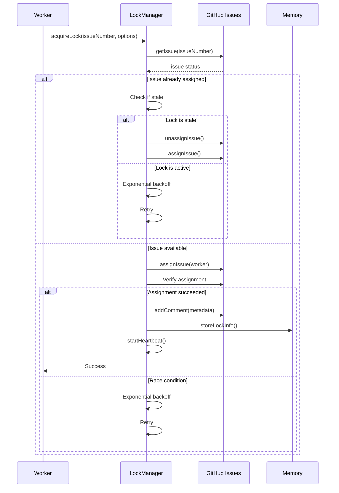
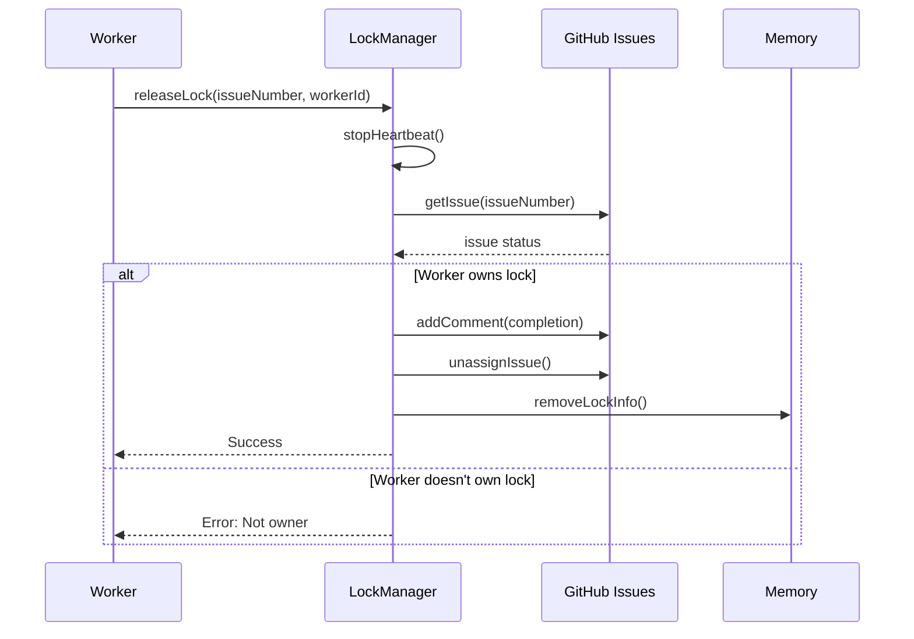

# Distributed Locking System

## Overview

The distributed locking system uses GitHub Issues as a coordination mechanism to ensure multiple workers can safely execute tasks without conflicts. This implements a distributed lock manager with atomic operations, conflict resolution, and automatic heartbeat monitoring.

## Architecture

### Components

1. **LockManager** (`src/distributed/lock-manager.ts`)
   - Core distributed locking coordinator
   - Handles lock acquisition, release, and conflict resolution
   - Manages heartbeat mechanism for stale lock detection
   - Tracks metrics for monitoring

2. **GitHubClient** (`src/distributed/github-client.ts`)
   - Wraps GitHub CLI for atomic operations
   - Handles issue assignment (atomic lock)
   - Manages comments and metadata
   - Provides issue status queries

3. **Type Definitions** (`src/distributed/types.ts`)
   - Complete TypeScript interfaces for lock operations
   - Lock metadata format
   - Configuration options
   - Result types

## Lock Protocol

### Acquisition Flow



### Release Flow



## Lock Metadata Format

Lock metadata is stored as a GitHub comment in JSON format:

```json
{
  "lock": {
    "worker_id": "worker-local-1",
    "node_id": "node-abc123",
    "claimed_at": "2025-10-30T21:30:00Z",
    "heartbeat_last": "2025-10-30T21:35:00Z",
    "task_info": {
      "complexity": 5,
      "estimated_duration": "45min",
      "task_type": "bug-fix",
      "priority": "high"
    }
  }
}
```

## Conflict Resolution

### Strategies

1. **RETRY** (default)
   - Exponential backoff: 1s, 2s, 4s, 8s, 16s (max)
   - Max retries: 5
   - Best for temporary conflicts

2. **FAIL_FAST**
   - Immediately fail if lock is held
   - No retries
   - Best for optional tasks

3. **STEAL_STALE**
   - Check if lock is stale (no heartbeat > 5 minutes)
   - Force release and acquire
   - Best for crash recovery

4. **FORCE_ACQUIRE**
   - Always acquire lock (dangerous!)
   - No conflict checking
   - Use only for admin operations

### Exponential Backoff

```typescript
let backoffMs = 1000; // Initial: 1 second
const maxBackoffMs = 16000; // Max: 16 seconds

for (let retry = 0; retry < maxRetries; retry++) {
  await sleep(backoffMs);
  backoffMs = Math.min(backoffMs * 2, maxBackoffMs);
}
```

## Heartbeat Mechanism

### Purpose
- Detect worker crashes
- Prevent zombie locks
- Enable stale lock recovery

### Configuration
```typescript
{
  heartbeatIntervalMs: 30000,  // 30 seconds
  lockTimeoutMs: 300000         // 5 minutes
}
```

### Heartbeat Flow
1. On lock acquisition, start interval timer
2. Every 30 seconds, post heartbeat comment to GitHub
3. Update `heartbeat_last` timestamp in memory
4. On lock release, stop heartbeat timer

### Stale Detection
- Lock is stale if: `now - heartbeat_last > lockTimeoutMs`
- Stale locks can be forcibly released with `STEAL_STALE` strategy

## Usage Examples

### Basic Lock Acquisition

```typescript
import { LockManager, ConflictStrategy } from './distributed';

const lockManager = new LockManager({
  githubRepo: 'owner/repo',
  maxRetries: 5,
  initialBackoffMs: 1000,
  maxBackoffMs: 16000,
  heartbeatIntervalMs: 30000,
  lockTimeoutMs: 300000
});

// Acquire lock
const result = await lockManager.acquireLock(123, {
  workerId: 'worker-local-1',
  nodeId: 'node-abc123',
  taskInfo: {
    complexity: 5,
    estimated_duration: '45min',
    task_type: 'bug-fix',
    priority: 'high'
  }
});

if (result.success) {
  console.log(`Lock acquired on issue #${result.lockId}`);

  // Execute task...

  // Release lock
  await lockManager.releaseLock(123, 'worker-local-1');
} else {
  console.error(`Failed to acquire lock: ${result.error}`);
}
```

### With Conflict Strategy

```typescript
// Fail fast if locked
const result = await lockManager.acquireLock(123, {
  workerId: 'worker-1',
  nodeId: 'node-abc',
  taskInfo: { complexity: 3, estimated_duration: '20min' },
  conflictStrategy: ConflictStrategy.FAIL_FAST
});

// Steal stale locks
const result = await lockManager.acquireLock(123, {
  workerId: 'worker-1',
  nodeId: 'node-abc',
  taskInfo: { complexity: 3, estimated_duration: '20min' },
  conflictStrategy: ConflictStrategy.STEAL_STALE
});
```

### Check Lock Status

```typescript
const status = await lockManager.getLockStatus(123);

if (status.isLocked) {
  console.log(`Locked by: ${status.assignee}`);
  console.log(`Worker: ${status.metadata?.lock.worker_id}`);
  console.log(`Since: ${status.metadata?.lock.claimed_at}`);
} else {
  console.log('Issue is unlocked');
}
```

### Monitor Metrics

```typescript
const metrics = lockManager.getMetrics();

console.log(`Total acquisitions: ${metrics.totalAcquisitions}`);
console.log(`Total conflicts: ${metrics.totalConflicts}`);
console.log(`Average acquisition time: ${metrics.averageAcquisitionTimeMs}ms`);
console.log(`Failed acquisitions: ${metrics.failedAcquisitions}`);
console.log(`Stale locks claimed: ${metrics.staleLocksClaimed}`);
```

## Integration with Task Sentinel

### Worker Integration

```typescript
// In worker.ts
import { LockManager } from './distributed';

class Worker {
  private lockManager: LockManager;

  constructor() {
    this.lockManager = new LockManager({
      githubRepo: process.env.GITHUB_REPO!,
      // ... config
    });
  }

  async processTask(issueNumber: number) {
    // Acquire lock
    const lock = await this.lockManager.acquireLock(issueNumber, {
      workerId: this.workerId,
      nodeId: this.nodeId,
      taskInfo: {
        complexity: await this.estimateComplexity(issueNumber),
        estimated_duration: '30min'
      }
    });

    if (!lock.success) {
      console.log('Task already being processed by another worker');
      return;
    }

    try {
      // Execute task
      await this.executeTask(issueNumber);

    } finally {
      // Always release lock
      await this.lockManager.releaseLock(issueNumber, this.workerId);
    }
  }
}
```

### MCP Memory Integration

```typescript
// Store lock info in MCP memory
private async storeLockInMemory(
  issueNumber: number,
  metadata: LockMetadata
): Promise<void> {
  await mcp__claude_flow__memory_usage({
    action: 'store',
    key: `lock:issue-${issueNumber}`,
    value: JSON.stringify(metadata),
    namespace: 'distributed-locks',
    ttl: this.config.lockTimeoutMs
  });
}

// Retrieve lock info
private async getLockFromMemory(issueNumber: number): Promise<LockMetadata | null> {
  const result = await mcp__claude_flow__memory_usage({
    action: 'retrieve',
    key: `lock:issue-${issueNumber}`,
    namespace: 'distributed-locks'
  });

  return result ? JSON.parse(result) : null;
}
```

## Error Handling

### Common Errors

1. **Lock Acquisition Failed**
   - Cause: Max retries exceeded
   - Solution: Increase `maxRetries` or backoff settings
   - Recovery: Use `STEAL_STALE` strategy

2. **Race Condition**
   - Cause: Multiple workers attempting simultaneous acquisition
   - Solution: Automatic retry with exponential backoff
   - Recovery: Built-in retry mechanism

3. **Stale Lock**
   - Cause: Worker crashed without releasing lock
   - Solution: Heartbeat timeout detection
   - Recovery: Use `STEAL_STALE` strategy

4. **GitHub API Rate Limit**
   - Cause: Too many API calls
   - Solution: Increase backoff intervals
   - Recovery: Wait for rate limit reset

### Error Recovery

```typescript
try {
  const result = await lockManager.acquireLock(issueNumber, options);

  if (!result.success) {
    if (result.error?.includes('rate limit')) {
      // Wait and retry later
      await sleep(60000);
    } else if (result.error?.includes('already locked')) {
      // Check if stale
      const status = await lockManager.getLockStatus(issueNumber);
      // Handle stale lock
    }
  }
} catch (error) {
  console.error('Lock operation failed:', error);
  // Implement recovery strategy
}
```

## Performance Characteristics

### Metrics

- **Average acquisition time**: 200-500ms (no conflicts)
- **Average acquisition time with conflicts**: 2-10s (depending on retries)
- **Heartbeat overhead**: ~1 API call per 30 seconds per lock
- **Lock release time**: 200-300ms

### Scalability

- **Maximum concurrent locks**: Limited by GitHub API rate limits
- **Recommended workers per repo**: 10-50
- **GitHub API rate limit**: 5000 requests/hour (authenticated)

### Optimization Tips

1. Use `FAIL_FAST` for optional tasks
2. Increase heartbeat interval for long-running tasks
3. Use MCP memory for lock status caching
4. Batch lock operations when possible
5. Monitor metrics to tune backoff settings

## Testing

### Unit Tests

Run comprehensive test suite:

```bash
npm test tests/distributed/lock-manager.test.ts
```

### Integration Tests

Test with real GitHub Issues:

```bash
# Set up test repository
export GITHUB_REPO="your-org/test-repo"

# Run integration tests
npm run test:integration
```

### Mock GitHub Client

```typescript
import { vi } from 'vitest';
import { GitHubClient } from './distributed/github-client';

vi.mock('./distributed/github-client');

const mockClient = {
  getIssue: vi.fn(),
  assignIssue: vi.fn(),
  unassignIssue: vi.fn(),
  addComment: vi.fn()
};
```

## Security Considerations

1. **Authentication**: Uses GitHub CLI authentication
2. **Authorization**: Requires repo write access
3. **Metadata**: Avoid storing sensitive data in comments
4. **Rate Limiting**: Respects GitHub API limits
5. **Force Operations**: Restrict `FORCE_ACQUIRE` to admin roles

## Future Enhancements

1. **Lease Extension**: Extend lock duration dynamically
2. **Priority Queues**: Queue lock requests by priority
3. **Fair Queuing**: FIFO lock acquisition
4. **Distributed Deadlock Detection**: Detect circular dependencies
5. **Lock Upgrade/Downgrade**: Convert read locks to write locks
6. **Metrics Dashboard**: Real-time lock monitoring UI

## References

- [Distributed Systems Principles](https://en.wikipedia.org/wiki/Distributed_computing)
- [GitHub CLI Documentation](https://cli.github.com/)
- [Exponential Backoff Algorithm](https://en.wikipedia.org/wiki/Exponential_backoff)
- [Heartbeat Mechanisms](https://en.wikipedia.org/wiki/Heartbeat_(computing))
