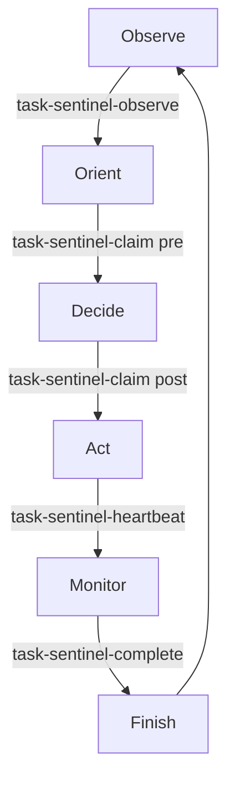

# Task Sentinel Hooks - Quick Reference

## Hook Triggers

### SessionStart
```bash
# Automatically triggers on Claude Code session start
# Restores context and resumes in-progress tasks
```

### Task Claim (Pre)
```bash
# Matcher: task-sentinel-claim (before)
# Validates dependencies and worker availability
npx claude-flow@alpha hooks pre-task \
  --description 'task-claim-validation' \
  --validate-dependencies true \
  --check-worker-availability true
```

### Task Claim (Post)
```bash
# Matcher: task-sentinel-claim (after)
# Initializes heartbeat and swarm memory
npx claude-flow@alpha hooks post-task \
  --task-id 'task-claim' \
  --initialize-heartbeat true \
  --memory-key 'task-sentinel/active/current-task' \
  --memory-namespace 'ooda-loop'
```

### Task Complete
```bash
# Matcher: task-sentinel-complete
# Cleanup memory, close issue, export metrics
npx claude-flow@alpha hooks post-task \
  --task-id 'task-complete' \
  --cleanup-memory true \
  --close-issue true \
  --export-metrics true \
  --memory-namespace 'task-sentinel/active'
```

### Heartbeat
```bash
# Matcher: task-sentinel-heartbeat
# Update GitHub issue with progress timestamp
npx claude-flow@alpha memory retrieve \
  --key 'task-sentinel/current-task' \
  --namespace 'ooda-loop' | \
jq -r '.issue_number // empty' | \
xargs -I {} gh issue comment {} \
  --body "[HEARTBEAT] Task in progress - $(date -Iseconds)"
```

### Observe (OODA Loop)
```bash
# Matcher: task-sentinel-observe
# List available tasks from GitHub
gh issue list \
  --label ready --label queued --state open \
  --json number,title,labels,assignees | \
jq '.[] | select(.assignees | length == 0)' | \
npx claude-flow@alpha memory store \
  --key 'task-sentinel/available-tasks' \
  --namespace 'ooda-loop'
```

### SessionEnd
```bash
# Automatically triggers on Claude Code session end
# Generates summary, persists state, exports metrics
npx claude-flow@alpha hooks session-end \
  --generate-summary true \
  --persist-state true \
  --export-metrics true \
  --memory-namespace 'task-sentinel/active'
```

---

## Manual Hook Invocation

### Trigger Observation
```bash
npx claude-flow@alpha hooks trigger --matcher task-sentinel-observe
```

### Trigger Heartbeat
```bash
npx claude-flow@alpha hooks trigger --matcher task-sentinel-heartbeat
```

### Restore Session Manually
```bash
npx claude-flow@alpha hooks session-restore \
  --session-id 'task-sentinel-session' \
  --restore-context true
```

---

## Memory Operations

### List Available Tasks
```bash
npx claude-flow@alpha memory retrieve \
  --key 'task-sentinel/available-tasks' \
  --namespace 'ooda-loop'
```

### Get Current Task
```bash
npx claude-flow@alpha memory retrieve \
  --key 'task-sentinel/current-task' \
  --namespace 'ooda-loop'
```

### Clear Active Tasks
```bash
npx claude-flow@alpha memory clear \
  --namespace 'task-sentinel/active'
```

### List All Memory Keys
```bash
npx claude-flow@alpha memory list --namespace ooda-loop
npx claude-flow@alpha memory list --namespace task-sentinel/active
```

---

## GitHub Operations

### List Ready Tasks
```bash
gh issue list \
  --label ready --label queued \
  --state open \
  --json number,title,assignees
```

### Claim Task
```bash
gh issue edit <ISSUE_NUMBER> \
  --add-assignee @me \
  --add-label in-progress \
  --remove-label queued
```

### Send Heartbeat
```bash
gh issue comment <ISSUE_NUMBER> \
  --body "[HEARTBEAT] Task in progress - $(date -Iseconds)"
```

### Complete Task
```bash
gh issue close <ISSUE_NUMBER> \
  --comment "Task completed successfully" \
  --add-label completed
```

---

## Debugging

### Check Hook Configuration
```bash
jq '.hooks' /workspaces/Task-Sentinel/.claude/settings.json
```

### Verify Environment Variables
```bash
jq '.env' /workspaces/Task-Sentinel/.claude/settings.json
```

### Test GitHub Integration
```bash
gh auth status
gh api rate_limit
```

### Check Memory Namespaces
```bash
npx claude-flow@alpha memory stats --namespace ooda-loop
npx claude-flow@alpha memory stats --namespace task-sentinel/active
```

---

## OODA Loop Workflow



### 1. Observe Phase
- List GitHub issues with `ready` and `queued` labels
- Store available tasks in memory

### 2. Orient Phase
- Validate task dependencies
- Check worker availability
- Assess task complexity

### 3. Decide Phase
- Claim task (assign to worker)
- Initialize task tracking
- Start heartbeat monitoring

### 4. Act Phase
- Execute task work
- Send periodic heartbeats
- Update progress in memory

### 5. Monitor Phase
- Track heartbeat timestamps
- Detect stale locks (>10 minutes)
- Alert on failures

### 6. Finish Phase
- Cleanup task memory
- Close GitHub issue
- Export metrics

---

## Configuration Files

| File | Purpose |
|------|---------|
| `.claude/settings.json` | Main hook configuration |
| `docs/hooks-configuration.md` | Detailed documentation |
| `docs/hooks-summary.md` | Implementation summary |
| `docs/hooks-quick-reference.md` | This quick reference |

---

## Environment Variables

```bash
# Required in .claude/settings.json
CLAUDE_FLOW_HOOKS_ENABLED=true
CLAUDE_FLOW_AUTO_COMMIT=false
CLAUDE_FLOW_AUTO_PUSH=false
CLAUDE_FLOW_TELEMETRY_ENABLED=true
CLAUDE_FLOW_REMOTE_EXECUTION=true
CLAUDE_FLOW_CHECKPOINTS_ENABLED=true
```

---

## Troubleshooting

### Hooks Not Triggering
1. Check `CLAUDE_FLOW_HOOKS_ENABLED=true`
2. Verify hook matcher patterns
3. Review Claude Code logs

### Memory Issues
1. Clear stale namespaces
2. Check memory stats
3. Verify memory key format

### GitHub Integration Failed
1. Authenticate: `gh auth login`
2. Check repository: `git remote -v`
3. Verify API limits: `gh api rate_limit`

---

**Quick Start**: See `/workspaces/Task-Sentinel/docs/hooks-configuration.md` for complete documentation

**Last Updated**: 2025-10-30
